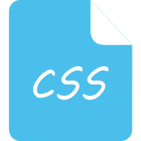

### Hi，我 是黎 | 是采黎 | 是小黎

你好， 我是 [黎](https://xiaoli.vip) ，一位有奇思妙想且喜欢做一些花里胡哨的小东西的前端开发人员。

- 💬 如果你对我感兴趣，可以加我[微信](https://xiaoli.vip) 进一步交流
- 📫 我的邮箱: [22708206@qq.com](https://xiaoli.vip)
- 📝 我的网站: [https://xiaoli.vip](https://xiaoli.vip)

 

#### 前端技术

<code></code>
<code></code>
<code></code>
<code></code>
<code></code>
<code></code>
<code></code>
<code></code>
<code></code>
<code></code>
<code></code>
<code></code>

#### 后端技术

<code></code>
<code></code>
<code></code>
<code></code>

#### 代码规范

<code></code>
<code></code>

#### 开发工具

<code></code>
<code></code>
<code></code>
<code></code>

---

#### 个人网站 | 技术社区

* [黎-小黎充电站](https://xiaoli.vip)
* [黎-掘金](https://juejin.cn/user/4438109753182343)
* [黎-CSDN](https://blog.csdn.net/weixin_53673959?type=blog)
